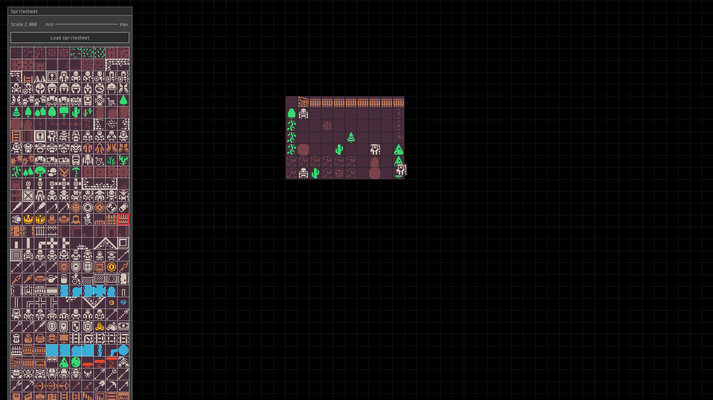

# Tyler



A tilemap editor written in Odin with Raylib.

## Requirements

- [odin](https://odin-lang.org/)
- [make](https://www.gnu.org/software/make/)

## Running

```bash
make run
```

## Todo

- randomly place tiles from multi selection
- scroll tile UI
- bucket tool
- scale slider
- adjustable map size
